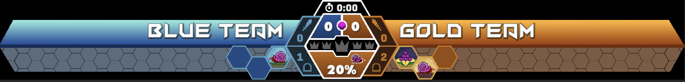
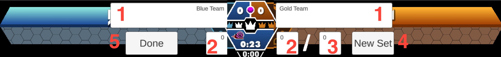

# Killer Queen Interactive Scoreboard

\[[Features](#features)\] \[[How to Use](#howtouse)\] \[[Setting Names and Scores](#scores)\] \[[Problems?](#bugs)\] \[[Changelog](#changelog)\]

The KQIS is a free overlay project that extends [HiveMind](https://kqhivemind.com) to bring live stats and tournament integration into your overlay with minimum work! You can plug the display into any existing OBS overlay without needing to re-design anything. 

## Features
- Live game updates including victory conditions, warriors up, team names, set points, and kill feeds
- Queen kill animations that shout out the player who got the kill
- Individual game point graphics that show what map and victory condition was achieved for each game in the set
- Post-game stats that focus on what each player did best, rather than show every number
- HiveMind integration with player names for signed in players
- Full integration with HiveMind tournaments including automatic team name and set score updates
- Ability to manually set team names and points for non-tournament settings
- Lots of fancy animations

## How to Use
1. Ensure your scene and cabinet are properly integrated into HiveMind. See [this guide](https://kqhivemind.com/wiki/Basic_Client_Setup) for getting things set up! Make a note of your HiveMind scene name and cabinet name for the next step.
2. In your OBS scene, add a new Browser source. Enter the following settings:
- URL: `https://kq.style/overlay/sceneName/cabinetName/` (replace sceneName with your scene name, and cabinetName with your cabinet name)
- Width and Height: The recommended resolution is 1200 x 140 which is the design resolution of the overlay. It will scale to any resolution but ensure an aspect ratio of at least 60:7 or wider, or some content may not appear correctly.
3. That's it! The overlay should load automatically and begin receiving game events. You can move and scale the scoreboard window to suit your scene's overlay.

### Need an OBS Overlay?

To get a very basic scene file for use in OBS, go to `https://kq.style/overlay/sceneName/cabinetName/obs_scene`, again replacing sceneName and cabinetName with your HiveMind values. In OBS, go to Scene Collection -> Import, click Add, open the downloaded file and then click the checkmark on the list to add it. Switch to the new "KQIS Simple Overlay" setup in the Scene Collection menu, and then add your stream sources for the game and (optionally) player cameras.

## Tournament Integration
The KQIS will automatically adjust team names and points when it detects a HiveMind tournament is running. Follow [these instructions](https://kqhivemind.com/wiki/Running_a_Tournament) for how to do tournament integration. There is no need to manually adjust anything in the overlay during the tournament, everything is managed through HiveMind.

## Manually Changing Team Names and Scores
You can also adjust scores and team names manually, which will be necessary when not running a tournament. In OBS, click the overlay's Browser source and click Interact. In the pop-out window, click anywhere inside the overlay to show the edit interface.

Edit these fields to adjust the following parameters:

1. Set team names for each team.
2. Set number of games won for each team. This is automatically tallied by the scoreboard, but you can use this for manual adjustment when needed.
3. Set maximum number of wins to show on each side (So for a Best of Three, enter 2).
4. Click "New Set" when a new set is about to begin. This resets both team scores to 0 and resets all tracked data from the last series of games.
5. When you are done with adjustments, click the "Done" button to save and exit the edit interface.

Tip: You can keep the Interact window tucked away to easily adjust things in the future.

## Bugs? Questions? Feedback?
This is a project for the KQ community, so your thoughts and help are very welcome! Message me on Discord at `lucidsheep#8535`.

### Known Issues
- Visual errors when cabinet is reversed (Gold on left)
- Game start animation not properly synced on bonus maps
- Center scoreboard is not designed for bonus maps (since it always assumes one snail and three queen lives)
**Known issues without fixes** (limitations of event system)
- Cabinet attract mode sends messages to the scoreboard, resulting in weirdness (Will be fixed in a future game update)
- Snail scoreboard is not always accurate. (Will be fixed in a future game update with a new snail event)

## Changelog
v15 (8/4/22)
- Better formatting for the post-game set score on the top
- Added "longest life" stat to queens (was previously only looking at warriors)
- (Finally) fixed the game point hexes to show the correct day / victory graphic
- Fixed incorrect calculation on post-game snail meters stat (thanks Abby!)
- Fixed set scores sometimes not displaying in the post-game screen

v14 (8/1/22)
- Re-redesigned the snail display in the center scoreboard. It's now an easier to understand percentage with snail direction. (Thanks for the feedback everyone)
- Improved formatting on the post-game screen. Team names keep their same font and size, and added an easier to read set point display
- Personal snail stats changed to "snail meters" instead of "snail seconds"

v13 (7/14/22)
- Fixed incorrect calculation of snail countdown clock
- Game time clock moved to top of hex (it was crowding the snail clock at the bottom)
- Added game time symbol to clock and increased size slightly
- Added horizontal scrolling to background hexes

v12 (7/11/22)
- Complete re-design of the center scoreboard! Thanks to many in the KQ community for listening to my ramblings about this.
  - Queen kills are now represented as a bar of visual crowns that both teams fill in, racing for the center (3rd) crown.
  - Snail is now a shared score box and is a countdown instead of percent. It shows how many seconds the controlling team needs to get a snail victory. The countdown will speed up for speed snail and pause for when the snail eats or if the rider leaves.
  - Snail display also has a "neutral" state when it has no rider, that shows how much time each team needs to win.
  - Completely unnecessary animation of a killed queen's crown entering the center display.
- Post-game snail score is now displayed as time (seconds moving the snail) instead of an arbitrary number.

v11 (7/3/22)
- Updated Vermin Vibes font for cleaner look (thanks coppola!)
- Fixed blue score boxes not lighting up on point scored
- Fixed rendering issues when wider than 1200 x 140
- Fixed Chex's spelling (thanks KQ community for determining the canonical spelling)
- (server) Improved default OBS overlay

v10 (6/28/22)
- Fixed rendering issue with overlay background appearing not completely transparent
- Increased design resolution to 1200 x 140 (from 1200 x 120)
- Added game clock at bottom of center hexagon

v9 (6/26/22)
- Added capability for any scene / cabinet connected to HiveMind to use the overlay (was previously hard-coded for one cabinet)
- Overlay now gets live game events from a HiveMind feed instead of a custom relay server (thank you Abby!!)
- Stats now properly reset after a tournament warm-up game
- Fixed bug with not showing the correct victory graphic on game points (update - still broken, fixed in v15)
- Post-game stats are no longer reversed on blue's side
- Post-game stats now show up correctly on the last game in a set

v8 (6/19/22)
- Overlay now automatically gets team name and score data during a HiveMind tournament
- Added queen kill "jumbo" animation with killing player's sprite and name
- Secondary stat "wings" that track warriors up and gates controlled by each team
- Set points redone with custom graphics for victory conditions (thank you Dylan H. for the custom graphics!)
- Kerning adjustments on team names, more readable fonts on post-game team names and player names
- "Pointy" ends to overlay instead of flat sides

v4 (6/6/22)
- First public release